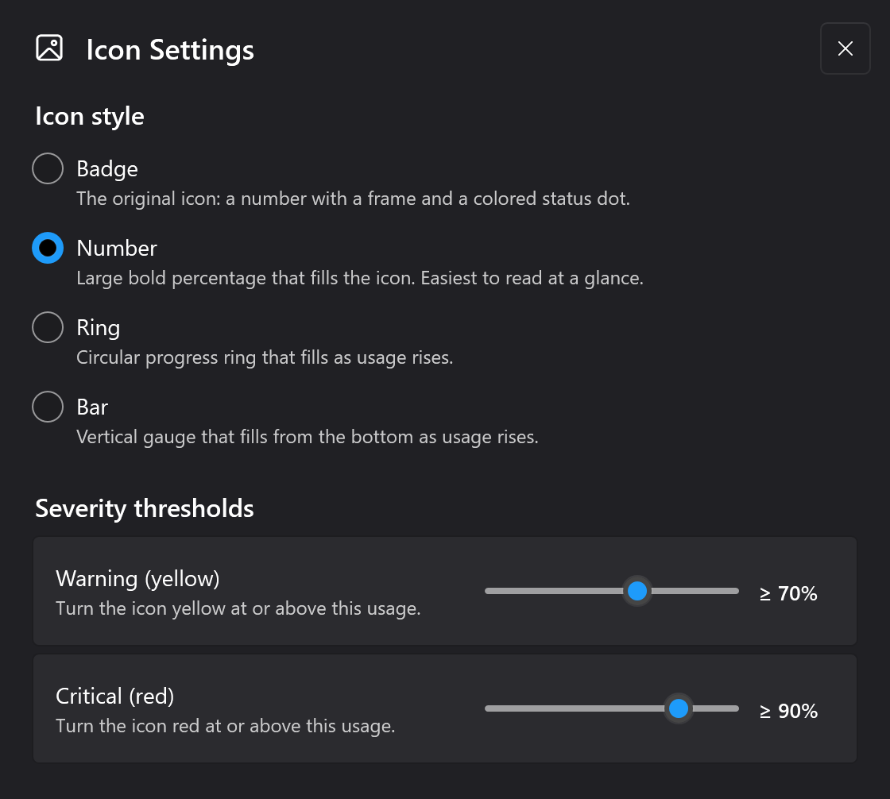
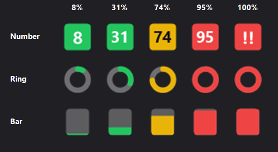

# Claude Usage Monitor for Windows

Monitor your Claude Code rate limits in real time right from your Windows system tray.

A native Windows tray app that shows your Claude usage at a glance. 

Lightweight (~6 MB single EXE) and fast native .NET app with Fluent Design UI. Works with both **Claude Code native for Windows** and **Claude Code in WSL**. 

Rate limits are shared across claude.ai, Claude Code, and its IDE extensions, so you always know how much of your session and weekly limits you have left.


## Features

- **Native & lightweight** — single EXE (~6 MB), no installation, no Electron, no Python. Download and run
- **Zero configuration** — authenticates through your existing Claude Code login. No API key, no manual token entry
- **Speedometer gauges** — beautiful gauges with gradient arcs (green/orange/red), animated needle, tick marks, and percentage display
- **Time marker** — white line on each gauge showing elapsed time in the current period, so you can instantly see whether your usage is ahead of or behind the limit
- **Live tray icon** with dynamic SVG icons showing usage percentage (0-100%), color-coded status dot, and theme-aware colors for light and dark taskbars
- **Customizable tray icon** — pick how usage is drawn (Badge, Number, Ring, or Bar) and set your own warning/critical color thresholds, all from an **Icon Settings** window
- **Detail popup** (left-click) — Session gauge (5h window), Weekly gauge (7d window), plus collapsible Sonnet Only and Overage cards with gradient progress bars
- **Smart credential discovery** — automatically finds credentials from Claude Code native for Windows or WSL distros (Debian, Ubuntu, etc.), picking the most recently used installation when both exist
- **WSL availability guard** — WSL paths are skipped with a 3-second timeout if WSL isn't running, so native-only users experience zero startup delay
- **Fluent Design UI** — Windows 11 Mica backdrop, rounded corners, smooth slide-up animation, collapsible sections, auto-sizing window
- **Dark & light theme** — automatically follows your Windows theme in real time
- **14 languages** — English, German, French, Spanish, Portuguese, Italian, Japanese, Korean, Hindi, Indonesian, Chinese Simplified, Chinese Traditional, Polish, Russian — auto-detected from your Windows display language, with manual override from the context menu
- **Adaptive polling** — speeds up during active usage (5 min), normal interval (7 min), slows down when idle (20 min), aligns to imminent quota resets, and backs off on rate-limit errors with exponential backoff
- **Required API headers** — sends the `claude-code/*` User-Agent header (auto-detecting your installed Claude Code version) and `anthropic-beta` header
- **Launch at Login** — optional Windows startup via the right-click context menu

### Real-time session hooks (Beta)

Optionally let the app react to your Claude Code sessions live — both **local** and **remote** (SSH / WSL / another machine):


- **Live activity widget** — a floating desktop pill showing each active session's state: *thinking*, *running a tool*, *waiting for your input*, or *done*. Busy sessions pulse (green), sessions waiting on you pulse amber, and all dots pulse in sync. Multiple sessions appear as compact dots you can click to expand.
- **Show/hide shortcut** — double-tap a key (default **Right Alt**, rebindable) to toggle the widget from any app.
- **Toast notifications** — get a Windows toast when a session finishes or needs your input.
- **Remote sessions in one command** — run a single `curl … | sh` on the remote machine to install a tiny relay. It fails fast when the widget is offline (so it never stalls your session) and reconnects on its own. Includes an optional Windows Firewall auto-rule (handles the WSL Hyper-V firewall too).
- **Windows 11 Settings-style setup** — manage everything from a dedicated **Claude Code Hooks** window (tray menu): enable/disable hooks, pick the shortcut key, set up remote machines.

### Customizable tray icon

Choose how the usage percentage appears in your tray, and when it changes color, from the **Icon Settings** window (right-click the tray icon → **Icon Settings**):



- **Icon styles** — **Badge** (the classic number with a frame and status dot), **Number** (a large bold percentage that fills the icon — easiest to read at a glance), **Ring** (a circular progress arc), or **Bar** (a bottom-up fill gauge).
- **Severity thresholds** — set the usage levels at which the icon turns **yellow** (warning) and **red** (critical). Defaults are 70% and 90%, matching the previous fixed behavior.

The Number, Ring, and Bar styles, color-coded by severity:



## Requirements

- Windows 10 or Windows 11 (64-bit)
- [.NET 8.0 Runtime](https://dotnet.microsoft.com/download/dotnet/8.0)
- Claude Code installed and logged in (native Windows CLI, WSL, VS Code extension, or JetBrains plugin — any variant works). The app reads the OAuth token that Claude Code stores locally (`~/.claude/.credentials.json`).

## Quick Start

No build tools required. Download the latest `ClaudeUsage.exe` from the [Releases](https://github.com/sr-kai/claudeusagewin/releases) page, place it wherever you like, and run it.

## How to Use

| Action | What happens |
|--------|-------------|
| **Hover** over the tray icon | Tooltip shows session and weekly usage percentages with reset times |
| **Left-click** the tray icon | Opens the detail popup with gauges, Sonnet/Overage cards, and reset countdowns |
| **Right-click** the tray icon | Context menu: Refresh, Show/Hide Widget, Icon Settings, Launch at Login, Claude Code Hooks, Language selector, Exit |
| **Escape** or click outside | Closes the detail popup |

### Tray icon not visible?

Windows may hide new tray icons by default. To keep the icon always visible:

1. Right-click the taskbar, then **Taskbar settings**
2. Expand **Other system tray icons** (Win 11) or **Select which icons appear on the taskbar** (Win 10)
3. Toggle **ClaudeUsage** to **On**

## How It Works

The app automatically discovers your Claude Code OAuth credentials by searching (in order):

1. **Windows native**: `%USERPROFILE%\.claude\.credentials.json`
2. **WSL distros**: `\\wsl$\{distro}\home\{user}\.claude\.credentials.json` (Debian, Ubuntu, Kali, etc.)

If credentials are found in both locations, the most recently modified file is used, so it automatically follows whichever Claude Code installation you're actively using.

The app queries the Anthropic usage API with proper authentication headers and displays your current limits as speedometer gauges with live-updating countdowns and time markers.

> **Note:** This uses an undocumented API that could change at any time.

## Building from Source

1. Clone this repository
2. Open `visualstudio-project/ClaudeUsage/ClaudeUsage.sln` in Visual Studio 2022
3. Restore NuGet packages
4. Build in Release mode
5. Publish as single-file:
```
dotnet publish -c Release -r win-x64 --self-contained false /p:PublishSingleFile=true
```

## Tech Stack

- **C# / .NET 8** — native Windows performance, no interpreted runtime
- **WPF** with [WPF-UI](https://github.com/lepoco/wpfui) — Fluent Design System (Mica, dark/light theme)
- **WPF DrawingContext** — native hardware-accelerated gauge rendering (no SkiaSharp, zero extra native DLLs)
- **[Svg.NET](https://github.com/svg-net/SVG)** — dynamic tray icon rendering
- System.Windows.Forms.NotifyIcon — system tray integration

## License

MIT
